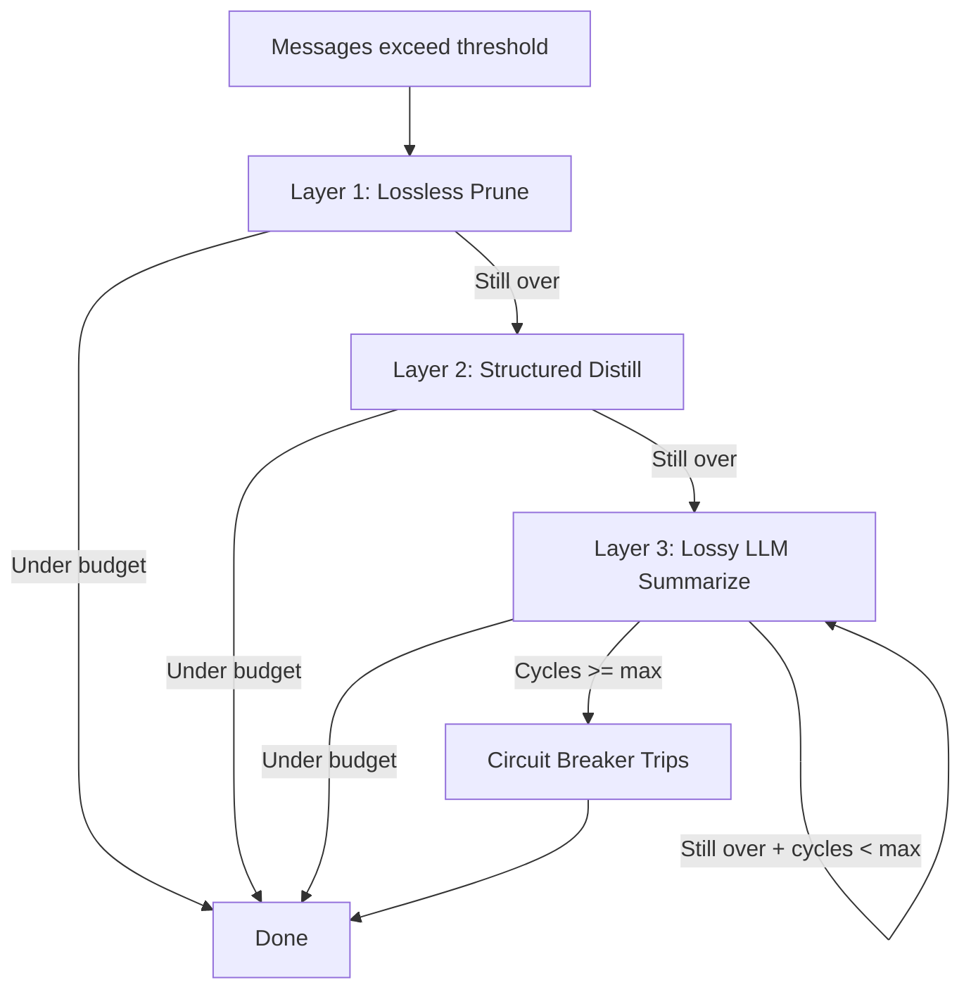

# Context compaction

> **Status:** implemented
> **Module:** cross-cutting (services layer)
> **Sources:** `app/services/multi_layer_compact.py`, `app/services/auto_compact.py`, `app/services/context_filters.py`, `app/services/chat_commands.py`
> **Tests:** `tests/unit/test_multi_layer_compact.py`, `tests/unit/test_context_filters.py`, `tests/unit/test_chat_commands.py`

## What problem this solves

Context windows are finite. Long agent sessions accumulate messages until the context budget is exhausted. Without compaction, the agent either crashes, hallucinates, or rushes to finish — a behavior called "context anxiety" (Lecture 5, walkinglabs).

Frontier harnesses solve this with multi-layer compaction: remove redundant content first (lossless), distill verbose content second (structured), summarize with an LLM third (lossy), and stop if the process cycles too many times (circuit breaker).

## How Cogentrex implements it

Three layers execute in order. Each checks whether the result is under the token budget threshold before escalating to the next, more destructive layer.

### Layer 1 — Lossless pruning

Removes content with zero information loss:
- Duplicate tool results (same tool, same output) replaced with recovery pointers
- Empty assistant messages removed
- No LLM call required

### Layer 2 — Structured distillation

Truncates verbose content while preserving key information:
- Messages exceeding a configurable max length get their middle removed
- First and last portions preserved with a truncation marker
- Recovery pointers stored for later retrieval

### Layer 3 — Lossy LLM summarization

Summarizes older messages using an LLM (with extractive fallback):
- Keeps the most recent N messages intact
- Older messages summarized into a compaction note
- Circuit breaker limits summarization cycles (default: 3)
- Recovery pointers generated for all summarized messages

## Chat commands

Users can trigger compaction manually:

| Command | What it does |
|---------|-------------|
| `/compact` | Force multi-layer compaction immediately |
| `/compact keep=5` | Compact, keeping only last 5 messages |
| `/clear` | Remove all non-system messages |
| `/resume <node_id>` | Resume from a session tree branch |
| `/init` | Show codebase orientation (AGENTS.md, init.sh) |

## Context budget tracking

Token budgets are allocated per category with hard caps:

| Category | Default budget |
|----------|---------------|
| System prompt | 4,000 |
| Instructions | 8,000 |
| Skills | 6,000 |
| Memory | 2,000 |
| History | 150,000 |
| Working | 30,000 |
| **Total** | **200,000** |

The `ContextUsage` tracker reports utilization per category and flags violations.

## Message history filtering

Three pluggable filters run before messages reach the model:
- `role_filter` — exclude specific roles (e.g., tool messages)
- `content_length_filter` — truncate oversized content
- `metadata_filter` — strip internal keys (`_source_message_id`, `_recovery_pointer`)

Filters are composable via `apply_filters(messages, [filter1, filter2])`.

## Memoized context builder

Expensive context assembly is cached by content hash. The cache invalidates automatically when input messages change, or can be force-invalidated on mutation events.

## Session branching

Sessions are stored as a tree. Branching creates a new node that copies messages up to a fork point, then diverges independently. This enables:
- Exploring alternative conversation paths
- `/resume` from any historical point
- Multi-branch experimentation without losing history

## Frontier harness comparison

| Mechanism | Claude Code | Pi | Codex | Cogentrex |
|-----------|------------|-----|-------|-----------|
| Multi-layer compaction | 5 layers | Incremental chain | Customizable prompt | 3 layers + circuit breaker |
| Lossless before lossy | Yes | Yes | — | Yes |
| Circuit breaker | Yes | — | — | Yes (max_compaction_cycles) |
| Session branching | Fork branches | Session tree | — | SessionTree with ancestry |
| /compact command | Yes | — | Yes | Yes |
| /resume command | Yes | — | — | Yes |
| Recovery pointers | — | — | — | Yes (content hash) |
| Message filtering | — | Yes | — | Yes (pluggable chain) |
| Context budget tracking | — | — | — | Yes (per-category) |
| Memoized context builders | — | — | — | Yes |

## Limitations

- LLM summarization requires a configured provider; falls back to extractive when unavailable.
- Recovery pointers are content-hash based; full content retrieval from pointers is not yet implemented.
- Session tree is in-memory; durable persistence to the database is deferred.
- No incremental chain compaction yet (summarizes all old messages at once, not incrementally).

## Interview / 30-second answer

Context compaction is the mechanism that lets long agent sessions survive finite context windows. Cogentrex uses a three-layer pipeline: lossless pruning first (remove duplicate tool results without any information loss), then structured distillation (truncate verbose messages while keeping key parts), and finally lossy LLM summarization with a circuit breaker to prevent runaway compaction cycles. Users can trigger compaction manually with `/compact`, clear context with `/clear`, or resume from any point in the session tree with `/resume`. Recovery pointers allow retrieving the original content later. The key design principle is: lossless before lossy, always.

## Self-check

1. Why must lossless pruning run before lossy summarization? What would go wrong in reverse order?
2. What does the circuit breaker prevent? How many cycles does Cogentrex allow by default?
3. How does `MemoizedContextBuilder` know when to invalidate its cache?
4. Explain the difference between `/compact` and `/clear`. When would you use each?
5. What are recovery pointers? How could they be used to retrieve summarized content?
6. Why does `ContextBudget` allocate separate budgets per category instead of one global limit?
7. How would you add a custom message filter that redacts PII before the model sees it?
