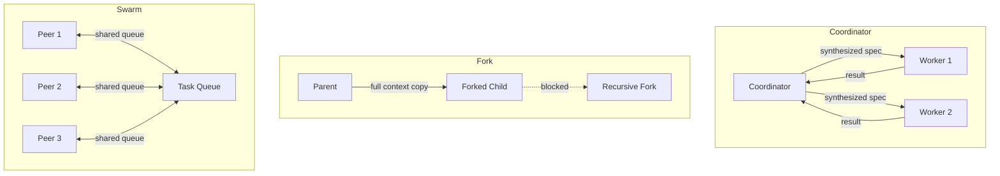

# Delegation patterns

> **Status:** implemented
> **Module:** `11-bounded-delegation`
> **Sources:** `app/delegation/patterns.py`, `app/delegation/service.py`, `app/delegation/envelope.py`
> **Tests:** `tests/unit/test_delegation_patterns.py`

## What problem this solves

A single agent working alone hits a ceiling: it can't review its own work objectively, it can't parallelize, and it can't specialize. Multi-agent delegation solves this — but naively spawning agents causes context explosion, conflicting actions, and unbounded resource consumption.

Frontier harnesses define three delegation patterns, each with explicit isolation and coordination rules.

## Three patterns



| Pattern | Context inheritance | Safety | Speed | Use case |
|---------|-------------------|--------|-------|----------|
| Coordinator | Zero — self-contained specs | Safest | Slowest | Complex research, multi-step tasks |
| Fork | Full parent copy, single level | Medium | Fast | Quick exploration, A/B testing |
| Swarm | Shared task queue only | Medium | Parallel | Persistent teams, batch processing |

## Per-worker tool filtering

Each worker gets only the tools it needs:
- **Researchers:** read_file, web_search, calculator (read-only)
- **Implementers:** read_file, write_file (specific whitelist)
- **Verifiers:** no tools (analysis only, like the existing EvidenceVerifier)

## Subagent configuration files

Workers can be configured via YAML files in `.cogentrex/agents/`:

```yaml
# .cogentrex/agents/researcher.yaml
worker_id: researcher
name: Research Agent
read_only: true
model: gpt-4
max_iterations: 10
```

## Frontier harness comparison

| Mechanism | Claude Code | Codex | Cogentrex |
|-----------|------------|-------|-----------|
| Coordinator (zero inheritance) | Sidechain subagents | spawn_agent/wait_agent | CoordinatorDelegation |
| Fork (full inheritance) | Fork branches | — | ForkDelegation (single-level) |
| Swarm (peer-to-peer) | — | — | SwarmDelegation (shared queue) |
| Recursive fork guard | — | — | ForkDelegation._is_forked check |
| Per-worker tool filtering | — | Per-agent TOML config | filter_tools_for_worker() |
| Config files | — | .codex/agents/*.toml | .cogentrex/agents/*.yaml |

## Limitations

- Delegation patterns are in-memory coordination primitives. They don't yet integrate with the full AgentRuntime for actual LLM execution.
- Swarm peers don't have automatic load balancing or health monitoring.
- Config files are YAML only (no TOML support yet).

## Interview / 30-second answer

Cogentrex implements three multi-agent delegation patterns from the frontier harness literature. The Coordinator pattern gives each worker a self-contained spec with zero context inheritance — safest but slowest. The Fork pattern copies the full parent context but blocks recursive forking to prevent context explosion. The Swarm pattern uses a shared task queue where persistent peers claim and process tasks independently. Each worker gets filtered tools based on its role — researchers get read-only access, implementers get specific write tools, verifiers get none. Worker configurations live in YAML files under `.cogentrex/agents/`.

## Self-check

1. Why does the Coordinator pattern use zero context inheritance? What problem does full inheritance cause?
2. What happens if a forked child tries to fork again? Why is this prevented?
3. How does the Swarm pattern differ from Coordinator for batch processing tasks?
4. Why should researchers have read-only tools while implementers have write tools?
5. What is the role of `filter_tools_for_worker()` and when is it applied?
6. How would you extend the Swarm pattern with automatic load balancing?
7. Compare Cogentrex's delegation patterns with the existing EvidenceVerifierSpecialist. Which pattern does it follow?
