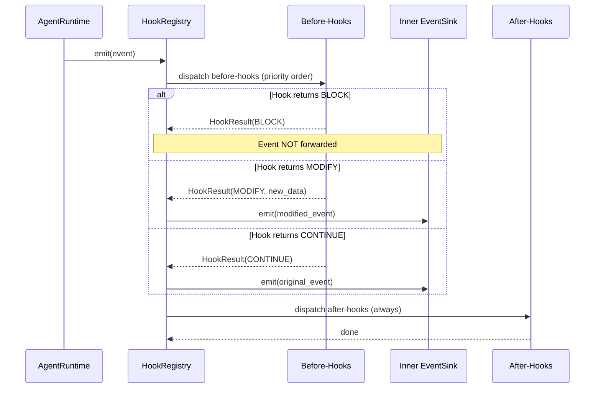

# Hooks and Extensions

> **Status:** implemented
> **Module:** cross-cutting (runtime layer)
> **Sources:** `app/runtime/hooks.py`, `app/runtime/builtin_hooks.py`, `app/routes/hooks.py`
> **Tests:** `tests/unit/test_hook_system.py`, `tests/unit/test_builtin_hooks.py`, `tests/unit/test_hook_api.py`

## What problem this solves

The agent runtime emits 23 event kinds during execution (tool requests, policy decisions, approvals, reflections, run start/stop). Without hooks, the only consumers are the SSE stream and run ledger — both read-only observers. Users cannot inject custom logic at these lifecycle points.

Frontier harnesses (Claude Code, Codex, Pi, DeepSeek) all provide extension points where custom code runs before or after tool execution, at stop time, or when specific events fire. Without this, a harness is a closed box.

## What a hook is

A hook is a function registered against an event kind and phase:

```
HookRegistration:
  hook_id:    unique identifier
  event_kind: AgentEventKind (e.g., tool_call_requested, run_stopped)
  phase:      before | after
  handler:    async or sync callable(AgentEvent) → HookResult | None
  priority:   int (lower = fires first)
```

## How hooks work

The `HookRegistry` wraps an `EventSink` (the composable pattern). When the runtime emits an event:

1. **Before-hooks** run in priority order. Each can:
   - `CONTINUE` — pass through, no change
   - `BLOCK` — stop the event from reaching the inner sink (e.g., block a dangerous tool call)
   - `MODIFY` — replace the event data before forwarding

2. **Inner sink** receives the event (unless blocked)

3. **After-hooks** run regardless of blocking (for audit/observability)

```
Runtime emits event
  │
  ├─ Before-hooks (priority order)
  │   ├─ hook₁: CONTINUE → pass
  │   ├─ hook₂: MODIFY → replace data
  │   └─ hook₃: BLOCK → skip inner sink
  │
  ├─ Inner EventSink (SSE/recording/null)
  │   └─ only reached if no BLOCK
  │
  └─ After-hooks (always run)
      └─ audit, logging, metrics
```

## Error isolation

Hooks must never crash the agent pipeline:
- Exceptions in handlers are caught and logged
- Timeouts (default 5s) cancel hung handlers
- A broken hook does not prevent the event from reaching the inner sink

## Trust boundary

In untrusted workspaces, ALL hooks are disabled:
- Registration raises `ValueError`
- Events pass directly to the inner sink with zero hook execution
- This is the "all-or-nothing hook trust" pattern from Claude Code

## Built-in hook patterns

Five ready-to-use hooks cover common frontier mechanisms:

| Hook | What it does | Mechanism |
|------|-------------|-----------|
| `protected_paths_hook` | Blocks tool calls targeting `.env`, `.git/**`, `/etc/**` | Bypass-immune protected paths (CC, PI, TR) |
| `protected_commands_hook` | Blocks `rm -rf`, `DROP TABLE`, etc. | Protected commands (TR) |
| `stop_verification_hook` | Blocks run completion without verification evidence | Stop hooks / premature victory prevention (CC) |
| `tool_output_sanitizer_hook` | Redacts API keys, PII from tool output | Tool output modification (PI, DS) |
| `external_signal_hook` | Injects CI/webhook/file-watcher data into context | External signal injection (PI, DS) |

## REST API

```
POST   /api/hooks     — Register a built-in hook
GET    /api/hooks     — List hooks (optional ?event_kind= filter)
DELETE /api/hooks/{id} — Remove a hook
DELETE /api/hooks      — Clear all hooks
```

## Frontier harness comparison

| Mechanism | Claude Code | Codex | Pi | DeepSeek | Cogentrex |
|-----------|------------|-------|-----|----------|-----------|
| PreToolUse hooks | ✅ | — | ✅ | ✅ | ✅ HookPhase.BEFORE on TOOL_CALL_REQUESTED |
| PostToolUse hooks | ✅ | — | ✅ | ✅ | ✅ HookPhase.AFTER on TOOL_CALL_COMPLETED |
| Stop hooks | ✅ | — | — | — | ✅ stop_verification_hook |
| Hook trust boundary | ✅ | — | — | — | ✅ trusted=False disables all |
| Protected paths | ✅ | — | ✅ | — | ✅ protected_paths_hook |
| Protected commands | — | — | — | — | ✅ protected_commands_hook |
| Tool output modification | — | — | ✅ | ✅ | ✅ tool_output_sanitizer_hook |
| External signal injection | — | — | ✅ | ✅ | ✅ external_signal_hook |

## Limitations

- Hooks are session-scoped (cleared on server restart). Durable hook persistence is deferred.
- Hook handlers cannot currently be loaded from SKILL.md packages (future integration).
- The REST API only supports built-in hook types. Custom handler code requires Python.
- No ML-based risk classification (uses rule-based patterns instead).

## Architecture diagram



## Interview / 30-second answer

Hooks let users attach custom logic to agent lifecycle events — before a tool runs, after it completes, or when the agent declares done. The HookRegistry wraps any EventSink, intercepts events, and runs user-registered handlers that can block, modify, or observe. Before-hooks fire in priority order and can prevent dangerous tool calls (protected paths, dangerous commands) or inject external signals from CI/webhooks. After-hooks always run for audit. Error isolation ensures a broken hook never crashes the pipeline. In untrusted workspaces, all hooks are disabled — the all-or-nothing trust model from Claude Code.

## Self-check

1. What is the difference between a before-hook and an after-hook? Which can block events?
2. If a before-hook raises an exception, does the event still reach the inner EventSink? Why?
3. Why does HookRegistry implement the EventSink protocol? What composability does this enable?
4. Explain the trust boundary: what happens when `trusted=False`? Why is this "all-or-nothing"?
5. How does `protected_paths_hook` check paths? What argument keys does it inspect?
6. What is the purpose of `stop_verification_hook`? What frontier mechanism does it implement?
7. How would you use `external_signal_hook` to inject CI build status into agent context?
