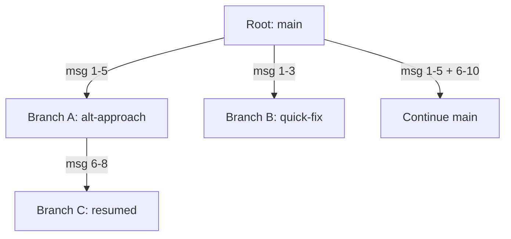

# Session branching

> **Status:** implemented
> **Module:** cross-cutting (services layer)
> **Sources:** `app/services/session_tree.py`, `app/services/chat_commands.py`
> **Tests:** `tests/unit/test_session_tree.py`, `tests/unit/test_chat_commands.py`

## What problem this solves

In a linear conversation, exploring an alternative approach means losing the current thread. If the agent takes a wrong turn at message 15, there's no way to go back to message 15 and try a different path — the conversation is a one-way stream.

Session branching stores conversations as trees instead of lists. Any point in the conversation becomes a potential fork point, and each branch preserves its own independent history.

## How Cogentrex implements it

### SessionTree

The `SessionTree` manages nodes, each containing:
- `node_id`: unique hash identifier
- `parent_id`: link to parent node
- `messages`: deep copy of the conversation at this point
- `children`: list of child node IDs
- `metadata`: branch-specific data

### Operations

| Operation | Method | What it does |
|-----------|--------|-------------|
| Create root | `create_root()` | Start a new session tree |
| Branch | `branch(node_id, at_message_index)` | Fork from a specific message |
| Switch | `switch_to(node_id)` | Change active branch |
| Resume | `resume_from(node_id)` | Create branch at end, continue |
| Export | `export_node(node_id)` | Serialize for sharing |
| Ancestry | `get_ancestry(node_id)` | Get root→node path |

### Message independence

Branches deep-copy messages at fork time. Modifying a branch does not affect the parent or siblings. This is critical for safe experimentation.

## Frontier harness comparison

| Mechanism | Claude Code | Pi | Cogentrex |
|-----------|------------|-----|-----------|
| Session tree | Sidechain files | `/tree` returns to any node | `SessionTree` with ancestry |
| Branch from any point | Fork branches | Branch from any node | `branch(node_id, at_index)` |
| Resume | `/resume` | — | `resume_from(node_id)` |
| Export | — | HTML/gist export | JSON export with metadata |

## Limitations

- Session tree is in-memory (cleared on restart). Database persistence is deferred.
- No HTML/gist export format yet (JSON only).
- Maximum tree depth is not enforced; very deep trees could use significant memory.

## Interview / 30-second answer

Session branching stores agent conversations as a tree instead of a linear list. Any message becomes a potential fork point — you can branch from message 15, try an alternative approach, and the original conversation remains intact. Each branch deep-copies messages at fork time so modifications are isolated. The `/resume` command creates a branch at the current end of a node, effectively continuing where a previous session left off. This enables safe experimentation, A/B conversation testing, and recovering from agent mistakes without losing work.

## Self-check

1. Why does `branch()` deep-copy messages instead of sharing references?
2. What is the difference between `branch()` and `resume_from()`?
3. How does `get_ancestry()` reconstruct the path from root to any node?
4. What would happen if branches shared message references instead of copies?
5. How could you implement undo/redo on top of the session tree?
6. Why is the session tree in-memory? What would database persistence require?
7. How would you implement session export as HTML for sharing?
