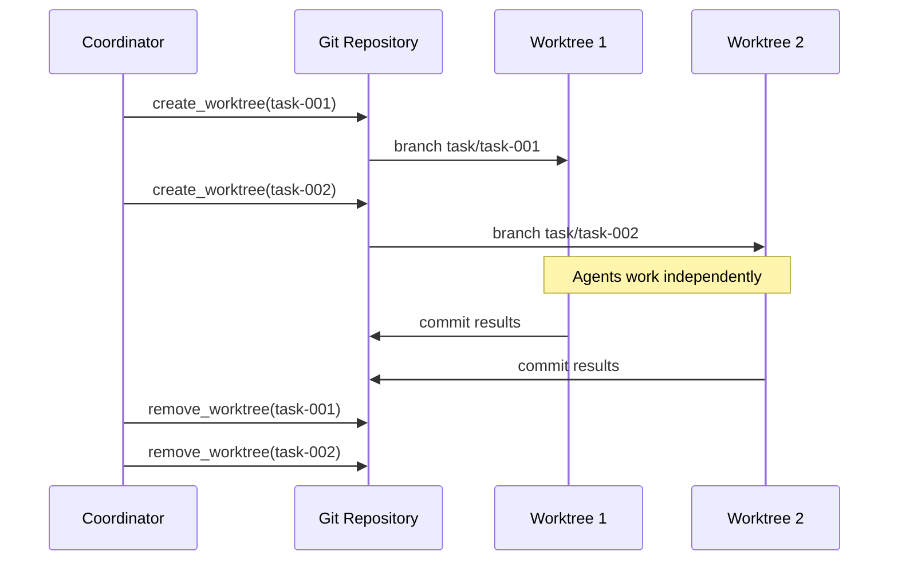

# Worktree isolation

> **Status:** implemented
> **Module:** cross-cutting (services layer)
> **Sources:** `app/services/environment.py`
> **Tests:** `tests/unit/test_environment.py`

## What problem this solves

When multiple agents work on the same repository, they compete for the same files. Agent A edits `main.py` while Agent B reads it — the result is corruption, merge conflicts, or silent data loss. Git worktree isolation gives each agent its own working directory backed by a shared repository.

## How Cogentrex implements it

### Key operations

| Function | What it does | Safety |
|----------|-------------|--------|
| `create_worktree(repo, task_id)` | Creates isolated working directory with new branch | Validates git repo, uses subprocess with timeout |
| `remove_worktree(repo, path)` | Cleans up worktree and branch | Force-removes, returns bool |
| `capture_environment(cwd)` | Snapshots cwd, git state, Python/Node versions | No side effects |
| `compute_delta(old, new)` | Computes only changed fields between snapshots | Returns changed_fields, new/removed env vars |
| `generate_system_md(cwd)` | Auto-detects runtime and writes SYSTEM.md | Read-only system inspection |

### Environment delta tracking

Instead of sending the full environment state to the model on every turn, Cogentrex computes deltas — only changed fields (cwd, branch, commit, env vars) are sent. This saves context tokens and prevents information overload.

An `EnvironmentSnapshot` captures: working directory, git branch, git commit, Python version, Node version, and optionally environment variables (filterable by prefix). The `compute_delta()` function compares two snapshots and returns only what changed.

### SYSTEM.md generation

The `generate_system_md()` function auto-detects the runtime environment (Python version, Node version, OS, architecture, git state) and produces a markdown file agents can read for orientation. This implements the "SYSTEM.md for environment self-description" pattern from Pi.

### Git worktree mechanics

Git worktrees share the same `.git` object store but have independent working directories and index files. This means:
- Agents can check out different branches simultaneously
- File changes in one worktree don't affect others
- Commits go to the shared repository
- Worktrees are lightweight (no full clone needed)

The `create_worktree` function creates a task-specific branch (`task/{task_id}`) for each worktree, ensuring clean isolation.

## Limitations

- Worktree creation requires git and a valid repository. Non-git projects are not supported.
- Environment deltas track a fixed set of fields; custom fields require code changes.
- SYSTEM.md is generated on-demand, not auto-updated on environment changes.

## Interview / 30-second answer

Worktree isolation gives each agent task its own git working directory so multiple agents can work in parallel without file collisions. Cogentrex creates worktrees with `git worktree add`, assigns each a task-specific branch, and cleans up after completion. Environment delta tracking sends only changed fields to the model (branch changed, cwd changed) instead of the full state — saving context tokens. SYSTEM.md auto-generation describes the runtime environment so agents can orient themselves without manual documentation.

## Self-check

1. Why is git worktree isolation better than simple directory copying for parallel agents?
2. What does environment delta tracking save compared to sending the full snapshot?
3. What fields does `compute_delta()` track? How would you add custom fields?
4. Why does `create_worktree()` create a new branch per task instead of using the same branch?
5. What happens if a worktree creation fails? How does the error propagate?
6. How does SYSTEM.md differ from AGENTS.md in purpose and content?
7. When would you NOT use worktree isolation (i.e., when is a single working directory acceptable)?
