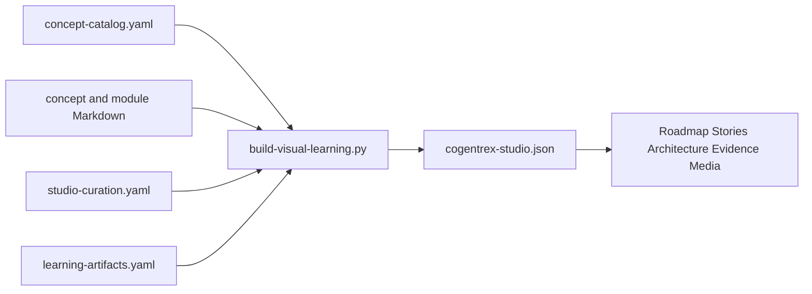

# Visual Learning Studio

The Visual Learning Studio is a multi-view learning interface derived from Cogentrex's canonical course, architecture, and evidence sources. It does not replace those sources.

## Open it

With the managed application running, authenticate and visit:

```text
/learn
```

The legacy `/learn/map` route redirects to the structured Stories view.

## Views

| View | Question it answers | Contains |
|------|---------------------|----------|
| Learn | What should I learn next? | Roadmap + Workflow Stories |
| Reference | How is the system structured? | Architecture layers + Evidence matrix + Glossary |
| Media | How do I review through video, audio, and study tools? | All media types in unified pack view |

The Studio never displays the full concept catalog as an unlabeled physics graph.

## Source-grounded video series

The **Cogentrex From the Code** series appears in the Studio at `/learn?view=media` when learning media is enabled and the configured external library contains the `code-first-series` pack.

Each video package contains:

- an immutable MP4 served through a short-lived signed URL;
- a timed transcript used for accessible text and WebVTT captions;
- source references pinned to the artifact's declared source revision;
- explicit limitations distinguishing derived teaching material from implementation evidence;
- a checksum validated before the catalog is exposed.

The videos are not a parallel documentation system. Canonical explanations remain under `docs/course/concepts/`; modules sequence those concepts, and video transcripts link back to the same concept pages, source files, and tests. A source change can therefore make a video stale without changing the canonical concept definition.

`review-ready` means the package is wired and technically validated but still awaits learner acceptance. Only accepted revisions should be promoted to `published`.

## One-source pipeline



Canonical inputs:

- `docs/course/concept-catalog.yaml`
- `docs/course/concepts/*.md`
- `docs/course/modules/*/README.md`
- `docs/visual-learning/studio-curation.yaml`
- `docs/visual-learning/learning-artifacts.yaml`
- `docs/visual-learning/hermes-generation-promptbook.md`

Generated browser data:

- `frontend/static/learning/cogentrex-studio.json`

## Regenerate and verify

```bash
backend/.venv/bin/python scripts/build-visual-learning.py
backend/.venv/bin/python scripts/build-visual-learning.py --check
backend/.venv/bin/pytest -q \
  backend/tests/unit/test_visual_learning_graph.py \
  backend/tests/unit/test_learning_source_packs.py \
  backend/tests/unit/test_learning_pilot.py \
  backend/tests/unit/test_learning_packs.py \
  backend/tests/unit/test_learning_media.py \
  backend/tests/unit/test_learning_media_routes.py
cd frontend
npm run check
npx vitest run
npx playwright test tests/visual-learning.spec.ts
```

## Hermes-native learning media

Hermes is an offline, supervised publishing lane, not a runtime dependency and not a canonical evidence store. The first review-ready pilot is the English `request-lifecycle` pack. It includes a standalone HTML deck, three diagrams, a structured mind map, 20 flashcards, 10 scenario questions, a study guide, real Edge TTS audio, and a HyperFrames explainer video. The media files remain outside Git, and Luis's content review is still required before the catalog status can become `published`.

```bash
backend/.venv/bin/python scripts/build-learning-pilot.py \
  --output ../cogentrex-learning-media \
  --audio ../cogentrex-learning-media/candidates/request-lifecycle/request-lifecycle-english.mp3 \
  --video ../cogentrex-learning-media/candidates/request-lifecycle/request-lifecycle-video-final.mp4
```

Default output:

```text
../cogentrex-learning-media/
```

The publisher:

- uses only allowlisted public repository files;
- rejects missing, escaping, unsupported, or secret-like paths;
- preserves canonical source paths and SHA-256 checksums;
- records the exact source commit and English-only language contract;
- renders deterministic HTML/SVG/JSON artifacts;
- publishes only through the validated external catalog;
- never makes Hermes a dependency of normal page requests.

Learning-pack definitions:

- System Overview
- Request Lifecycle and Governed Tools
- Memory, RAG, and Evaluation
- Reliability, Security, and Operations
- Interview and Demo Preparation
- Hybrid Agent Orchestration Pilot
- Azure Development Deployment and Safe Delivery

All seven recipes retain the same planned artifact families, but only artifacts present in the validated published catalog appear as available. The Azure deployment pack is source-ready in the tracked Studio manifest and its ten rich-media artifacts are packaged as `review-ready`; human pedagogical acceptance remains pending. The deterministic builders generate structured teaching artifacts and measured media scripts; audio/video count as available only after their real files pass the runbook checks.

The [Azure rich-media review](azure-deployment-operations-review.md) records TTS, captions, HyperFrames, encoded-frame, catalog, and release evidence.

Video captions use authored segment timing from each transcript. If an older transcript lacks timing, the player distributes fallback cues across the artifact's declared duration rather than assuming a fixed one-minute lesson.

Use [`hermes-generation-promptbook.md`](hermes-generation-promptbook.md) for generation contracts. Follow [`hermes-generation-runbook.md`](hermes-generation-runbook.md) for generation, media validation, publication, and local-runtime verification. NotebookLM files are deprecated migration references only; they are not the active generation lane.

## Base vs. Rich behavior

The Visual Learning Studio operates in two modes:

| Mode | Media available | How to get it |
|------|----------------|---------------|
| **Base** (default after clone) | Roadmap, Stories, Architecture, Evidence, and the searchable Glossary from the tracked Studio manifest. Present, Listen, and Study report that published media is unavailable. | Nothing extra needed. |
| **Rich** (after media install) | Everything above **plus** MP3 audio, MP4 video, high-fidelity SVG diagrams, and HTML presentation decks. | Install the checksummed media package (see below). |

### Vocabulary

The searchable Glossary remains part of the tracked Visual Learning manifest and is available in the Base installation without any Tutor or vector index.

### Install rich media (online)

```bash
make media-install
# or directly:
python3 scripts/learning-media-release.py install \
  --target ../cogentrex-learning-media \
  --manifest docs/visual-learning/release-manifest.json
```

This downloads the archive from the GitHub Release URL in `docs/visual-learning/release-manifest.json`, verifies its SHA-256 checksum and byte size, and atomically installs it.

Install it before the first managed-stack start. `local-stack.sh start` detects a
valid sibling library and enables the rich media routes automatically. The base
application remains available when the library is absent.

### Install rich media (offline / local archive)

```bash
python3 scripts/learning-media-release.py install \
  --target ../cogentrex-learning-media \
  --archive /path/to/cogentrex-learning-media.tar.gz \
  --manifest docs/visual-learning/release-manifest.json
```

### Package rich media (maintainer only)

```bash
make media-package MEDIA_LIBRARY=/path/to/cogentrex-learning-media
# or directly:
python3 scripts/learning-media-release.py package \
  --library /path/to/cogentrex-learning-media \
  --output dist/cogentrex-learning-media.tar.gz \
  --manifest-output docs/visual-learning/release-manifest.json
```

The packager validates catalog schema, source commit, all artifact SHA-256 checksums, rejects symlinks/non-regular files, and produces a byte-deterministic tar.gz archive. The release manifest must be committed and the archive uploaded as a GitHub Release asset.

### Security properties

- HTTPS-only downloads
- Pre-extraction SHA-256 + size verification
- Tar member validation: rejects absolute paths, `..` traversal, symlinks, hard links, device nodes, unexpected top-level entries, excessive member counts
- Post-extraction artifact checksum verification against catalog
- Atomic directory replacement with rollback
- Refuses to overwrite non-empty directories without `.cogentrex-learning-library` marker

## Honesty boundaries

- A visual component or green evidence cell does not upgrade capability status.
- Story arrows describe only the labeled runtime transition; they are not course prerequisites.
- Deferred concepts may intentionally lack source or test mappings.
- Generated outputs must be reviewed against canonical evidence before reuse.
- Provider credentials, profile memory, private course material, and generated large binaries must not enter Git.
- Exploration in the browser is not course-completion evidence.
